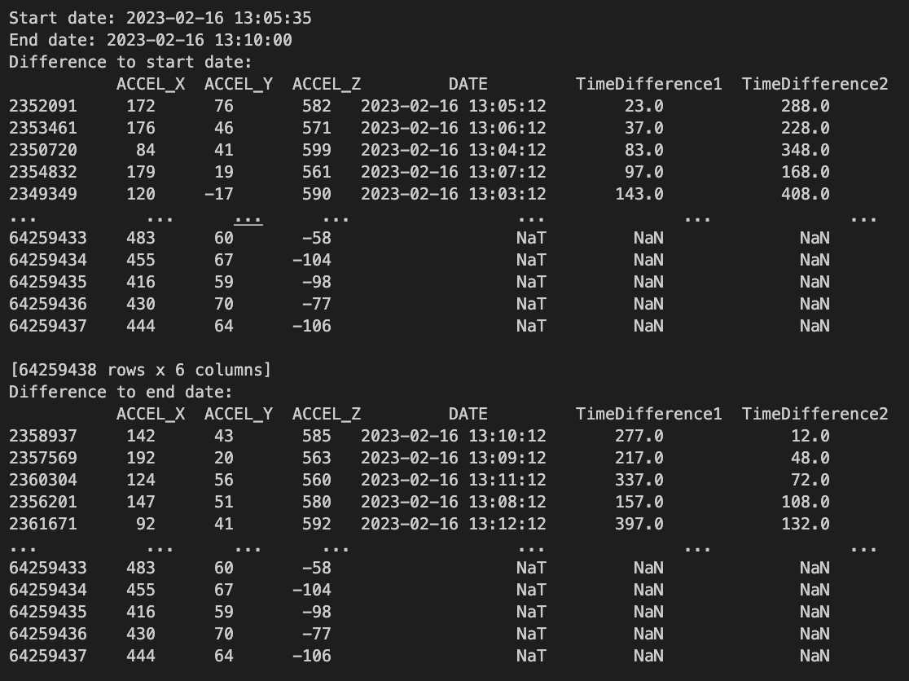
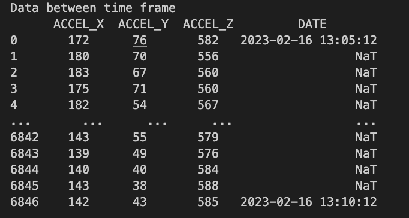
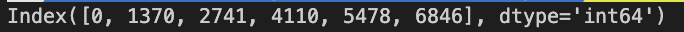
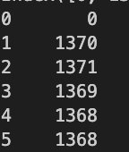
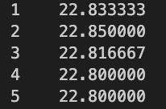
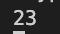
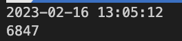
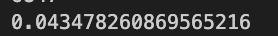
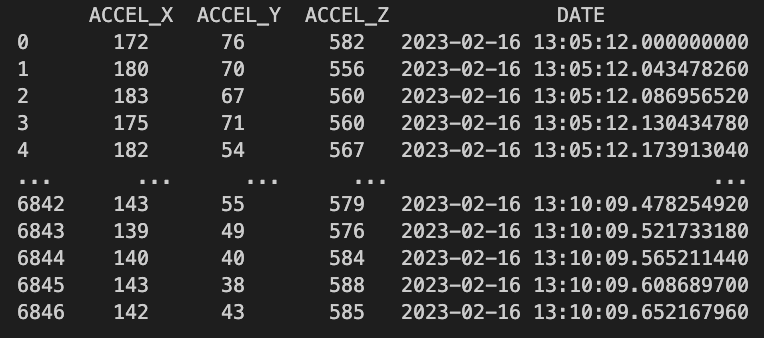

# Data Analysis

## Finding data between a given timeframe

```python
def find_start_and_end_data(data_file, start_date, end_date)
```

data_file: Dataframe of a cleaned data file
start_date and end_date: "YYYY-MM-DD HH:MM:SS"

The goal of this function is to find the rows of data that has the closest date to the given start and end dates by calculating the difference between the data files and the two dates. The rows with the minimum difference value is closest to the given dates. It returns the data between those two dates.

#### Step One: Calculate the difference for all dates to the start/end date

Once we have the index of the closest start and end dates. We use that to extract the data needed.



#### Step Two: Get data between start and end date



## Calculating the average hertz per second

```python
def get_average_hertz_per_second(data)
```

data: The dataframe returned from the function above

The goal of this function is to calculate the average hertz per second for the given dataframe. Since the dates are only shown every minute, we calculate the hertz across each minute and divide it by each minute to get the hertz per second. Finally, we calculate the mean across each minute to get the average hertz per second.

#### Step One: Find indices that have a date in the row



#### Step Two: Calculate how many for rows there are foreach minute (hertz per minute)



#### Step Three: Calculate hertz per second

We divide each of the minute counts by 60


#### Step Four: Get the mean hertz per second

We round the value to get our average hertz per second for the given time frame.


## Calculate dates

```python
def calculate_dates()
```

The goal of this function is to recalculate our dates based on our average hertz per second. Each row will increment the date column by 1/average hertz per second.

#### Step One: Get The initial Date

The date might not start at exactly the given start date so we need to make sure we have the exact date. We also need the length of the data frame - we can use this for how many rows we need to manipulate.


#### Step Two: Calculate the time to increment for each row by 1/average hertz per second.



#### Step Three: Store dates in Dataframe



## Plot Accelermeter Data

```python
def plot(data)
```

data: The data between the given start and end date

Plots X, Y, Z accelermeter data in its own plot with time on the x-axis

## Plot Amplitude

```python
def plot_amplitude()
```

Normalise the X, Y, Z values so that the mean shifts to zero. It will sum all three axis together and display a histogram of the amplitude for each row in the dataframe.

## Generate Report

```python
def generate_report()
```

The goal of this function is to calculate the mean, median, mode, and std for each axis. It will append that data in a csv file. It also stores the current sheep and the start and end date in the same row. The directory it is stored in is name `reports` and the file name is `stats.csv`

## Write Plot Data to File

```python
def write_to_file()
```

Writes plot data to a csv file. This is given from the original cleaned data file because it only save the data that you have selected in the given time frame and all rows will contain dates.

The directory it is stored in depends on the current plot opened `plots/XYZ` or `plots/Amplitude` and the file name is the name of the sheep + `_plot_data.csv`.

## Export Plot

```python
def export_plot()
```

Exports the current plot as a PNG. The directory it is stored in depends on the current plot opened `plots/XYZ` or `plots/Amplitude` and the file name is the name of the sheep.

## Start Analysis

```python
def start_analysis(data_file, start_date, end_date)
```

Calls the following functions:

```python
def find_start_and_end_data(data_file, start_date, end_date)
def get_average_hertz_per_second(data)
def calculate_dates()
def plot(data)
```
