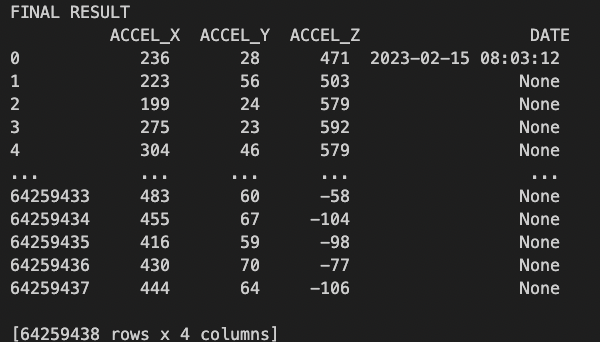

# Data Processing

## Reading

- The maximum files it will process is 35 days starting from the the 15th.
- Ignores any files that are empty.
- If it doesnt find a header in the first file it will stop processing that sheep and return an error.
- If it doesnt find day 15 it will stop processing that sheep and throw an error.
- Combines data from all files into a single DataFrame.

## Cleaning

- Finds the first instance of the 15th day (The first 15th day may be at the end of the file).
- Any row before that first instance is removed.
  

- Extract the first row 'DAY', 'MONTH', 'YEAR', 'HOUR', 'MINUTE', 'SECOND' and formats to it to (YYYY-MM-DD HH:MM:SS), this is used for future date calculations.
- Convert that date from GMT to AWST.

- Drop 'LAT', 'LON', 'DAY', 'MONTH', 'YEAR', 'HOUR', 'MINUTE', 'SECOND' columns.

- Creates a mask where ACCEL_X starts with a "\*" for every 1500 rows (one minute worth of data).
- Using that mask it calculates how many seconds to add based on the first date we extracted earlier.
- Add a 'DATE' column where the date will display every minute.
  

- Removes all rows where all three columns equals "-2048".

- Removes rows starting with "\*".
- Removes all rows where all three columns equals "0".
  

## Writing

Data is stored into one large file under the `cleaned_data` directory.

## Performance

Expected file output size: ~800MB
Expected time to read data: ~45 seconds
Expected time to clean data: ~2 minutes
Expected time to write to file: ~40 seconds
Total expected completion time for one sheep: ~3-4 minutes
